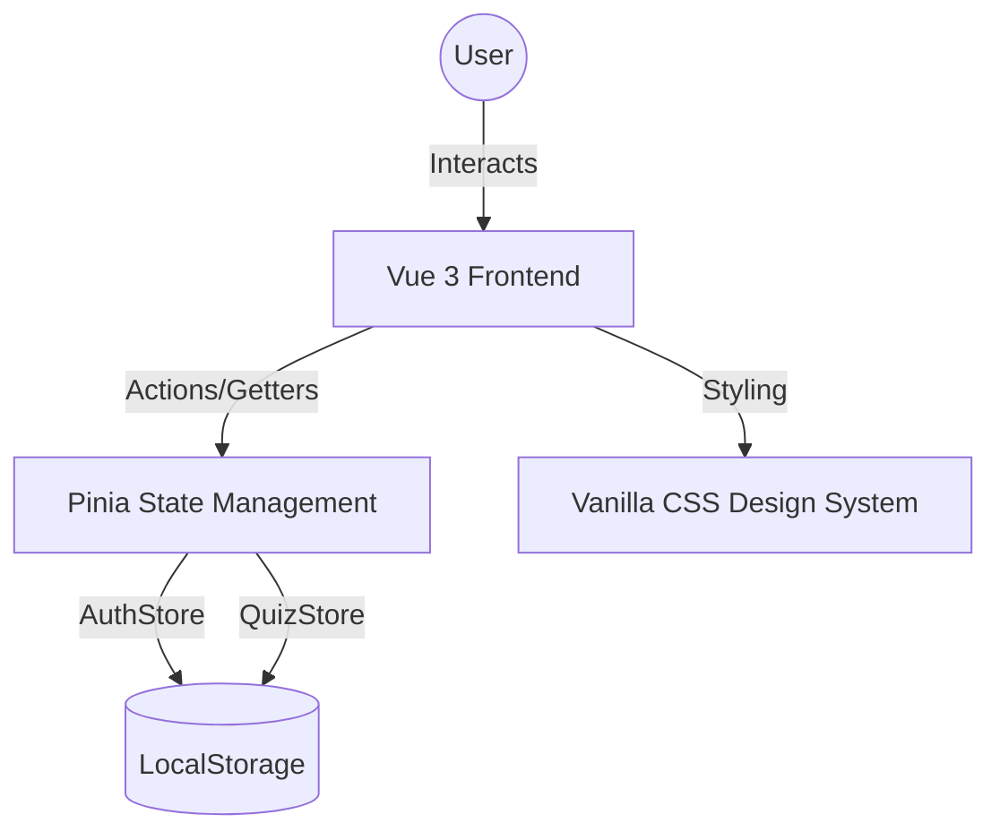
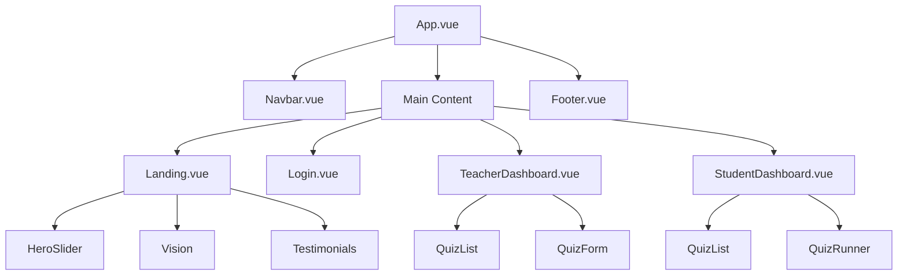
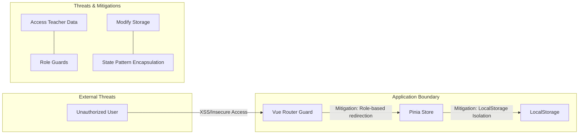

# QuizVista - Design & Architecture Documentation

This document provides a detailed overview of the Human-Centered Design (HCD) approach and the technical architecture of the QuizVista application.

## 👥 7. Human-Centered Design

### User Personas

#### Persona 1: Sarah, the Busy Educator
*   **Role:** High School Computer Science Teacher.
*   **Goal:** Quickly create and manage assessments without dealing with "clunky" legacy systems.
*   **Pain Points:** Systems that require too many clicks or have poor visual hierarchy.
*   **Needs:** A clean dashboard, bulk question entry, and immediate visual feedback on quiz status.

#### Persona 2: Hillary, the Ambitious Student
*   **Role:** University Sophomore.
*   **Goal:** Study for midterms in a distraction-free environment.
*   **Pain Points:** Exam portals that feel "stiff" or don't provide a sense of progress.
*   **Needs:** Engaging animations (feedback), clear progress tracking, and a premium aesthetic that makes studying less of a chore.

### Design Decisions
1.  **Emerald Forest & Warm Terra Palette:** We chose deep emerald (#023430) for its professional, "stable" feel, paired with mint and terra orange for vibrant calls-to-action that guide the user's eye.
2.  **Glassmorphism & Micro-animations:** Used to reduce the "cold" feel of traditional educational software, providing a modern, premium experience.
3.  **Sticky & Responsive Navigation:** Ensures that users (especially Teachers) always have access to core actions (Create/Sign Out) regardless of scroll position or device.

---

## 📊 8. Required Diagrams

### System Architecture Diagram
Visualizes the flow of data between the User, the Vue Frontend, and the State Management layer.



### Component Structure Diagram
The hierarchy of Vue components within the application.



### User Flow Diagram
Mapping the specialized journeys for both roles.

```mermaid
stateDiagram-v2
    [*] --> Landing
    Landing --> Login
    Login --> AuthCheck{Role?}
    
    AuthCheck --> Teacher: teacher@quiz.com
    Teacher --> ManageQuizzes: Dashboard
    ManageQuizzes --> CreateQuiz: + New Quiz
    CreateQuiz --> Save: Validate & Save
    Save --> ManageQuizzes
    
    AuthCheck --> Student: student@quiz.com
    Student --> BrowseQuizzes: Dashboard
    BrowseQuizzes --> TakeQuiz: Select
    TakeQuiz --> Playing: Answer Questions
    Playing --> Submitting: Submit
    Submitting --> Results: Percentage Count
    Results --> BrowseQuizzes: Confetti!
```

### Threat Model Diagram
Analyzes potential security risks and mitigations in our simulated environment.


