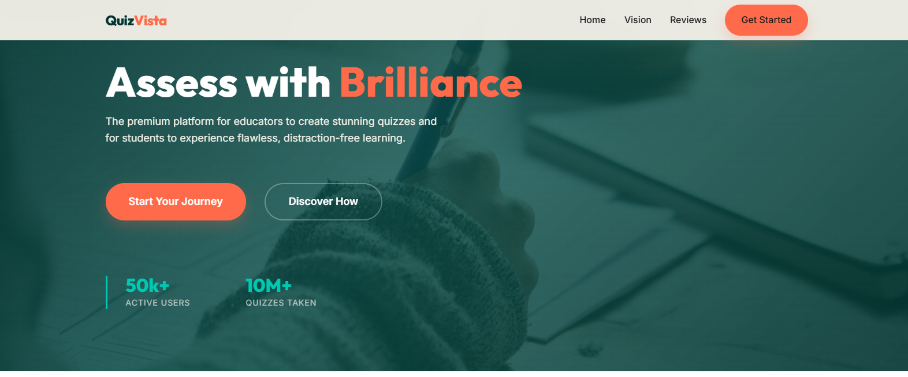
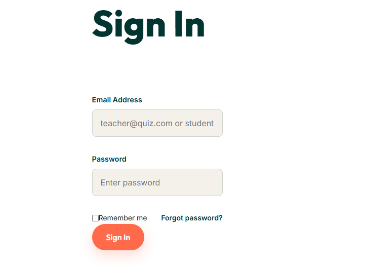
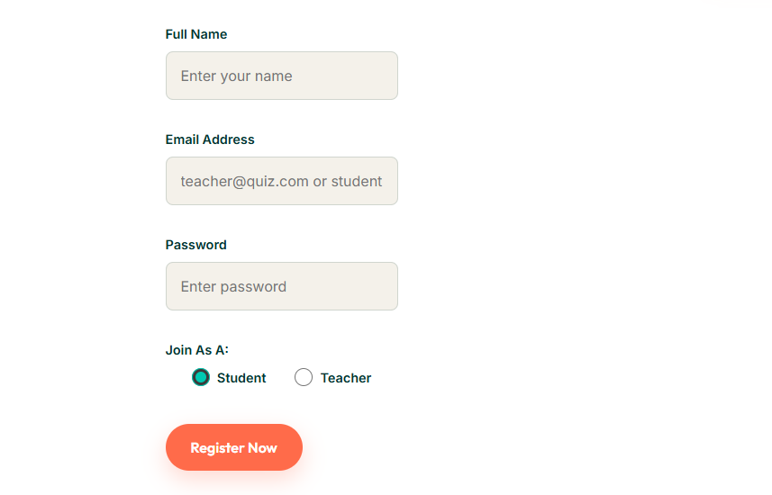
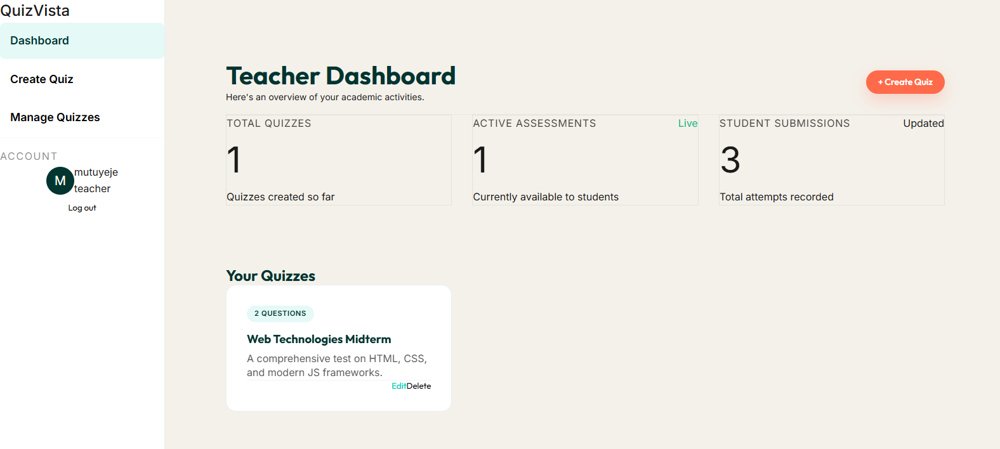
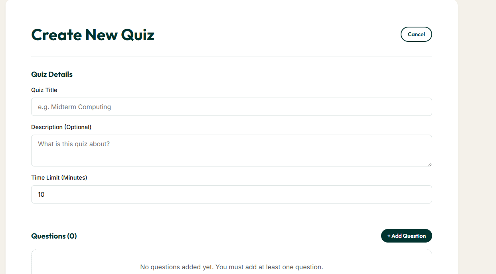
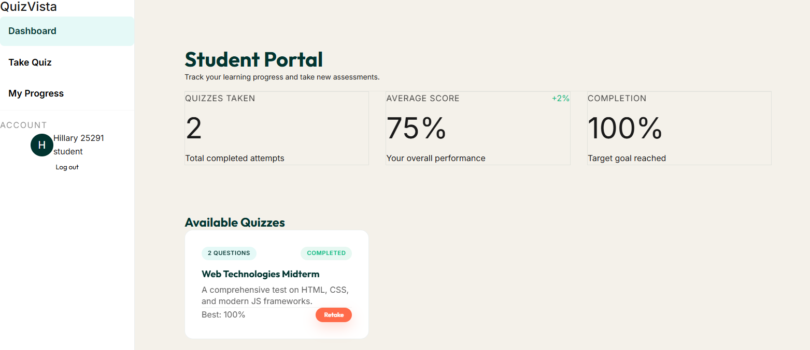

# Adventist University of Central Africa
## MIDTERM WEBTECHNOLOGIES EXAM PROJECT
### PROJECT NAME: **QUIZ VISTA**

---

##  Group Members
*   **MUTIMUTUJE PIERRE CELESTIN** - 26161
*   **MUHIRE HILLARY** - 25291

---

##  Project Overview
**Quiz Vista** is a premium, dynamic web application designed to streamline the assessment process for both teachers and students. Built with a focus on human-centered design, it provides an intuitive interface for creating, managing, and taking interactive quizzes. The system features real-time performance tracking and a modern dashboard experience.

---

##  Key Features
*   **Dynamic Dashboards:** Separate, tailored experiences for Teachers and Students with real-time statistics.
*   **Timed Assessments:** Teacher-configurable quiz durations with live countdown timers and auto-submission.
*   **Performance Analytics:** Students can track their achievement history, average scores, and progress over time.
*   **Responsive Sidebar Navigation:** A professional, persistent sidebar for quick access to all portals.
*   **Emerald Forest Theme:** A premium web aesthetic using modern typography (Outfit/Inter) and a professional color palette.

---

## Project Gallery

### 1. The Landing Page
The gateway to Quiz Vista, featuring a modern hero slider and smooth-scrolling navigation.

### 2. User Authentication
A clean, centered login and signup experience with clear role selection.

### 3. Teacher Dashboard
A centralized hub for educators to monitor assessments and student engagement.

### 4. Quiz Creation
A powerful form allowing teachers to set time limits and create complex questions.

### 5. Student Portal & Performance
Students can browse available quizzes and track their progress through dynamic stat cards.

---

##  Secure Design & Threat Modeling

### 1. Assets to Protect
*   **User Credentials:** Protecting passwords and email addresses from theft.
*   **Assessment Data:** Ensuring quiz questions and answers are not leaked or modified unauthorizedly.
*   **Student Results:** Protecting personal achievement history and performance metrics.

### 2. Possible Attackers
*   **Malicious Students:** Attempting to bypass time limits or view answers before starting.
*   **Automated Bots:** Attempting to brute-force login credentials.
*   **External Script-Kiddies:** Attempting to inject scripts into quiz forms (XSS).

### 3. Possible Threats
*   **Cross-Site Scripting (XSS):** Injecting scripts into quiz questions or descriptions.
*   **Unauthorized Access:** Accessing the Teacher Dashboard without proper credentials.
*   **Data Spoofing:** Manually modifying quiz scores in LocalStorage.

### 4. Mitigation Strategies
*   **Role-Based Authorization:** Strict checking of user roles (`admin`/`student`) before granting access to dashboard views.
*   **Frontend Validation:** Enforcing character limits and type checking on all form inputs.
*   **Data Sanitization:** Using Vue’s templating system which automatically escapes HTML, preventing inline injection.
*   **Session Management:** Clear logout mechanisms that wipe sensitive session data.

### 5. Security in Development
Security was considered as a core component by choosing **Pinia** for centralized state management, ensuring that user roles are verified at a global level before views are rendered.

---

##  Secure Coding Decisions

### 1. Avoiding Inline HTML Injection
We avoided using `v-html` or direct DOM manipulation. By using standard Vue interpolation (`{{ }}`), we ensure that any text entered by users is treated solely as data and never executed as code.

### 2. User Input Validation
All forms (Login, Signup, Quiz Creation) utilize strict validation. We check for required fields, character lengths, and specific data formats (e.g., email patterns) before data is processed by the store.

### 3. Protecting Sensitive Data
Password fields use `type="password"` to prevent shoulder surfing. Furthermore, we avoid exposing full user objects in the DOM, keeping only the necessary non-sensitive metadata for UI personalization.

---

##  Tech Stack
*   **Framework:** Vue 3
*   **State Management:** Pinia
*   **Routing:** Vue Router
*   **Styling:** Vanilla CSS (Emerald Forest Variable System)
*   **Build Tool:** Vite

---

##  How to Run
1.  Clone the repository: `git clone [https://github.com/KingTechFoundation/MIDTERM-QUIZ-APP]`
2.  Install dependencies: `npm install`
3.  Start dev server: `npm run dev`
